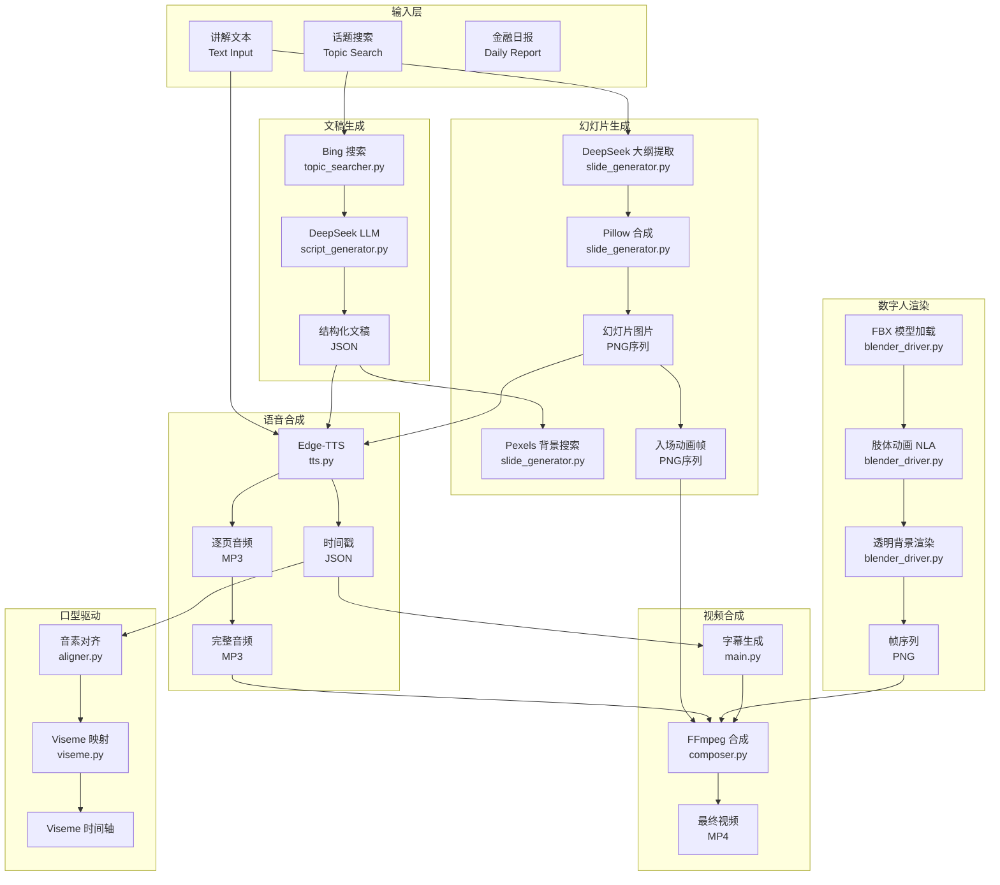
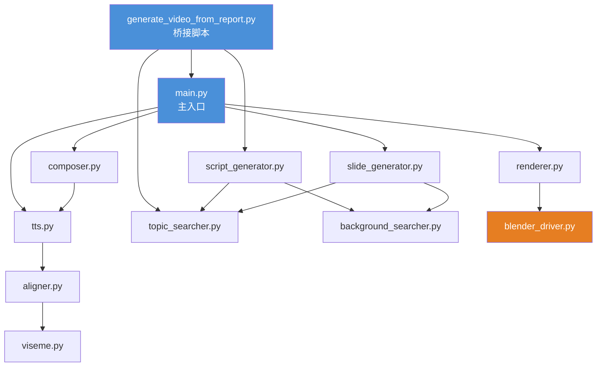
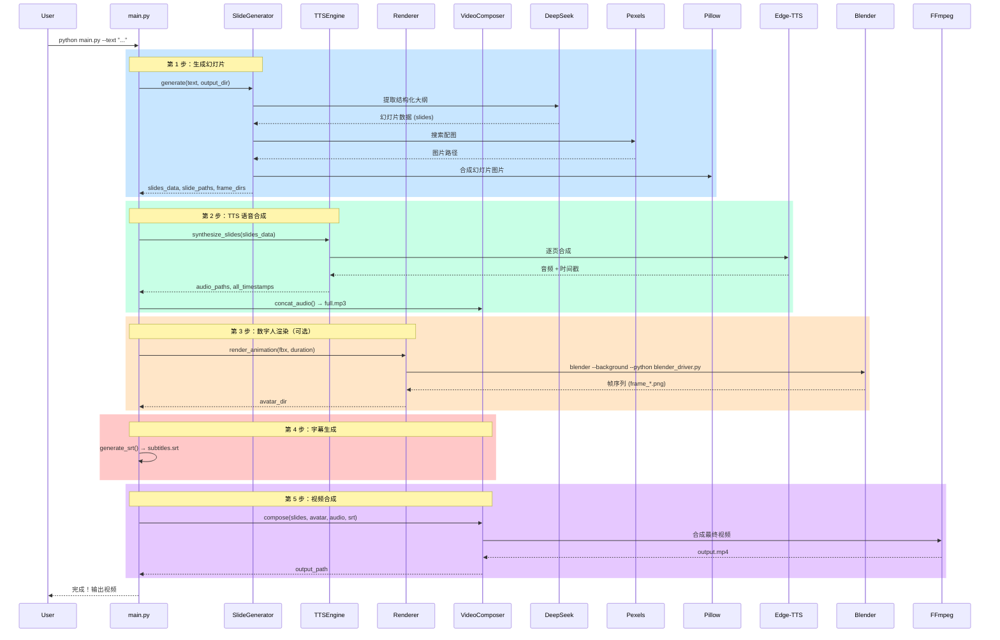
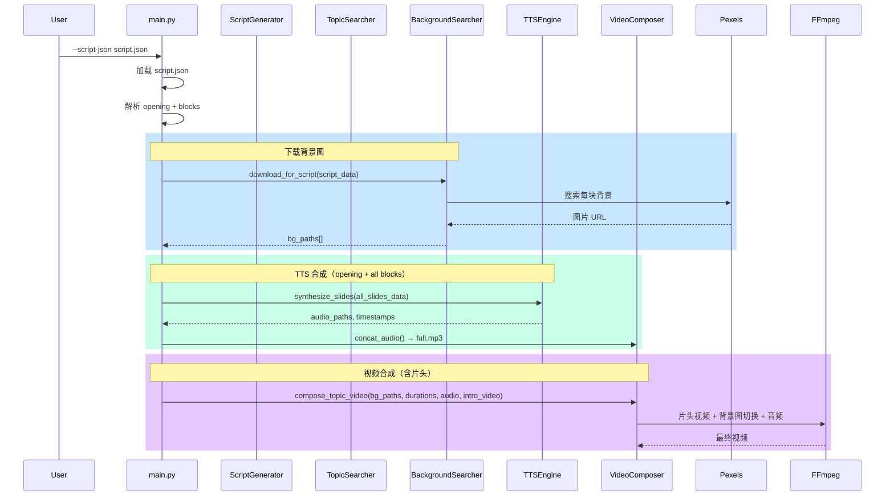
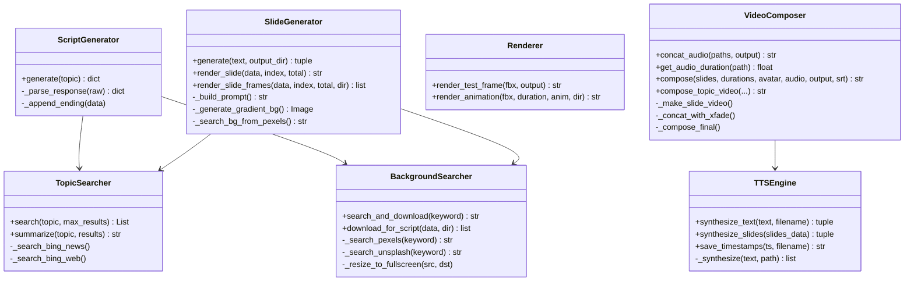

# 数据流与架构

---

## 一、整体数据流图

```mermaid
flowchart TB
    subgraph 输入层
        A1[讲解文本<br/>Text Input]
        A2[话题搜索<br/>Topic Search]
        A3[金融日报<br/>Daily Report]
    end

    subgraph 文稿生成
        B1[Bing 搜索<br/>topic_searcher.py]
        B2[DeepSeek LLM<br/>script_generator.py]
        B3[结构化文稿<br/>JSON]
    end

    subgraph 幻灯片生成
        C1[DeepSeek 大纲提取<br/>slide_generator.py]
        C2[Pexels 背景搜索<br/>slide_generator.py]
        C3[Pillow 合成<br/>slide_generator.py]
        C4[幻灯片图片<br/>PNG序列]
        C5[入场动画帧<br/>PNG序列]
    end

    subgraph 语音合成
        D1[Edge-TTS<br/>tts.py]
        D2[逐页音频<br/>MP3]
        D3[完整音频<br/>MP3]
        D4[时间戳<br/>JSON]
    end

    subgraph 口型驱动
        E1[音素对齐<br/>aligner.py]
        E2[Viseme 映射<br/>viseme.py]
        E3[Viseme 时间轴]
    end

    subgraph 数字人渲染
        F1[FBX 模型加载<br/>blender_driver.py]
        F2[肢体动画 NLA<br/>blender_driver.py]
        F3[透明背景渲染<br/>blender_driver.py]
        F4[帧序列<br/>PNG]
    end

    subgraph 视频合成
        G1[字幕生成<br/>main.py]
        G2[FFmpeg 合成<br/>composer.py]
        G3[最终视频<br/>MP4]
    end

    A1 --> C1
    A2 --> B1 --> B2 --> B3
    B3 --> C2
    C1 --> C3 --> C4
    C4 --> C5

    A1 --> D1
    B3 --> D1
    C4 --> D1
    D1 --> D2 --> D3
    D1 --> D4

    D4 --> E1 --> E2 --> E3

    C5 --> G2
    D3 --> G2
    F1 --> F2 --> F3 --> F4 --> G2
    D4 --> G1 --> G2
    G2 --> G3
```

---

## 二、模块依赖关系

```mermaid
graph TD
    main[main.py<br/>主入口] --> sg[slide_generator.py]
    main --> tts[tts.py]
    main --> renderer[renderer.py]
    main --> composer[composer.py]

    gvfr[generate_video_from_report.py<br/>桥接脚本] --> main
    gvfr --> script_gen[script_generator.py]
    gvfr --> ts[topic_searcher.py]

    script_gen --> ts
    script_gen --> bg_searcher[background_searcher.py]

    renderer --> bd[blender_driver.py]

    composer --> tts

    tts --> aligner[aligner.py]
    aligner --> viseme[viseme.py]

    sg --> ts
    sg --> bg_searcher

    style main fill:#4A90D9,color:#fff
    style gvfr fill:#4A90D9,color:#fff
    style bd fill:#E67E22,color:#fff
```

---

## 三、时序图 — 完整流水线

```mermaid
sequenceDiagram
    participant User
    participant Main as main.py
    participant SG as SlideGenerator
    participant TTS as TTSEngine
    participant Renderer as Renderer
    participant Composer as VideoComposer

    User->>Main: python main.py --text "..."

    rect rgb(200, 230, 255)
        Note over Main,SG: 第 1 步：生成幻灯片
        Main->>SG: generate(text, output_dir)
        SG->>DeepSeek: 提取结构化大纲
        DeepSeek-->>SG: 幻灯片数据 (slides)
        SG->>Pexels: 搜索配图
        Pexels-->>SG: 图片路径
        SG->>Pillow: 合成幻灯片图片
        SG-->>Main: slides_data, slide_paths, frame_dirs
    end

    rect rgb(200, 255, 230)
        Note over Main,TTS: 第 2 步：TTS 语音合成
        Main->>TTS: synthesize_slides(slides_data)
        TTS->>Edge-TTS: 逐页合成
        Edge-TTS-->>TTS: 音频 + 时间戳
        TTS-->>Main: audio_paths, all_timestamps
        Main->>Composer: concat_audio() → full.mp3
    end

    rect rgb(255, 230, 200)
        Note over Main,Renderer: 第 3 步：数字人渲染（可选）
        Main->>Renderer: render_animation(fbx, duration)
        Renderer->>Blender: blender --background --python blender_driver.py
        Blender-->>Renderer: 帧序列 (frame_*.png)
        Renderer-->>Main: avatar_dir
    end

    rect rgb(255, 200, 200)
        Note over Main,Composer: 第 4 步：字幕生成
        Main->>Main: generate_srt() → subtitles.srt
    end

    rect rgb(230, 200, 255)
        Note over Main,Composer: 第 5 步：视频合成
        Main->>Composer: compose(slides, avatar, audio, srt)
        Composer->>FFmpeg: 合成最终视频
        FFmpeg-->>Composer: output.mp4
        Composer-->>Main: output_path
    end

    Main-->>User: 完成！输出视频
```

---

## 四、话题模式数据流

```mermaid
sequenceDiagram
    participant User
    participant Main as main.py
    participant Gen as ScriptGenerator
    participant Searcher as TopicSearcher
    participant BG as BackgroundSearcher
    participant TTS as TTSEngine
    participant Composer as VideoComposer

    User->>Main: --script-json script.json

    Main->>Main: 加载 script.json
    Main->>Main: 解析 opening + blocks

    rect rgb(200, 230, 255)
        Note over Main,BG: 下载背景图
        Main->>BG: download_for_script(script_data)
        BG->>Pexels: 搜索每块背景
        Pexels-->>BG: 图片 URL
        BG-->>Main: bg_paths[]
    end

    rect rgb(200, 255, 230)
        Note over Main,TTS: TTS 合成（opening + all blocks）
        Main->>TTS: synthesize_slides(all_slides_data)
        TTS-->>Main: audio_paths, timestamps
        Main->>Composer: concat_audio() → full.mp3
    end

    rect rgb(230, 200, 255)
        Note over Main,Composer: 视频合成（含片头）
        Main->>Composer: compose_topic_video(bg_paths, durations, audio, intro_video)
        Composer->>FFmpeg: 片头视频 + 背景图切换 + 音频
        FFmpeg-->>Composer: 最终视频
    end
```

---

## 五、类结构图

### 核心类关系

```mermaid
classDiagram
    class ScriptGenerator {
        +generate(topic) dict
        -_parse_response(raw) dict
        -_append_ending(data)
    }

    class TopicSearcher {
        +search(topic, max_results) List
        +summarize(topic, results) str
        -_search_bing_news()
        -_search_bing_web()
    }

    class SlideGenerator {
        +generate(text, output_dir) tuple
        +render_slide(data, index, total) str
        +render_slide_frames(data, index, total, dir) list
        -_build_prompt() str
        -_generate_gradient_bg() Image
        -_search_bg_from_pexels() str
    }

    class BackgroundSearcher {
        +search_and_download(keyword) str
        +download_for_script(data, dir) list
        -_search_pexels(keyword) str
        -_search_unsplash(keyword) str
        -_resize_to_fullscreen(src, dst)
    }

    class TTSEngine {
        +synthesize_text(text, filename) tuple
        +synthesize_slides(slides_data) tuple
        +save_timestamps(ts, filename) str
        -_synthesize(text, path) list
    }

    class Renderer {
        +render_test_frame(fbx, output) str
        +render_animation(fbx, duration, anim, dir) str
    }

    class VideoComposer {
        +concat_audio(paths, output) str
        +get_audio_duration(path) float
        +compose(slides, durations, avatar, audio, output, srt) str
        +compose_topic_video(...) str
        -_make_slide_video()
        -_concat_with_xfade()
        -_compose_final()
    }

    ScriptGenerator --> TopicSearcher
    ScriptGenerator --> BackgroundSearcher
    SlideGenerator --> TopicSearcher
    SlideGenerator --> BackgroundSearcher
    VideoComposer --> TTSEngine
```
